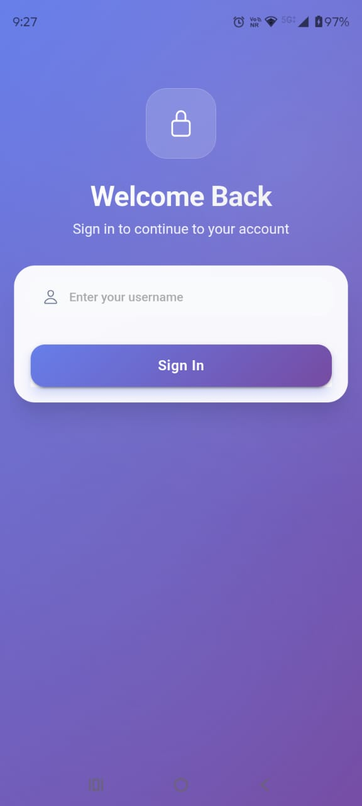
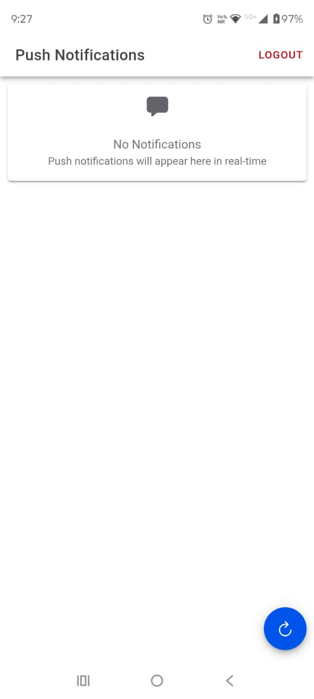
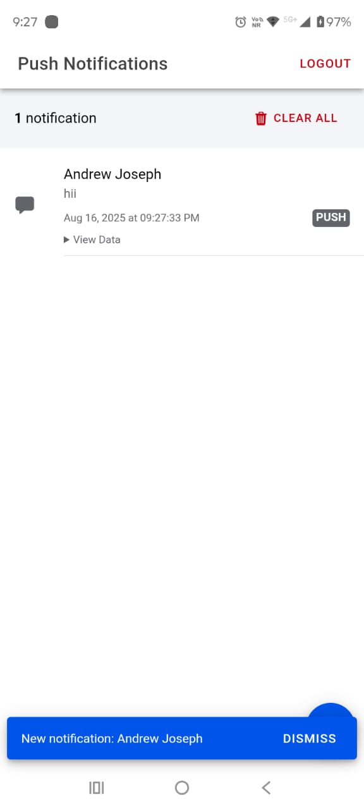
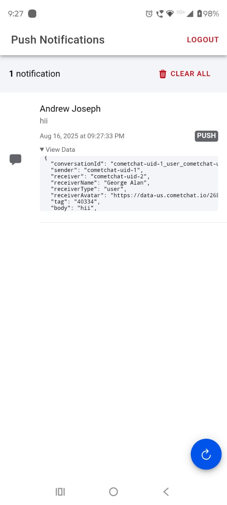
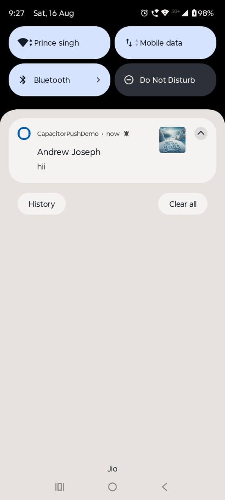
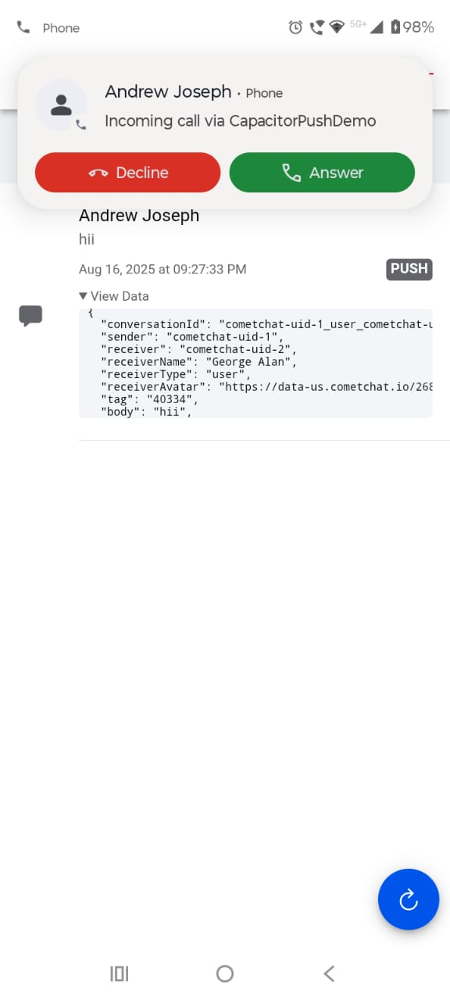
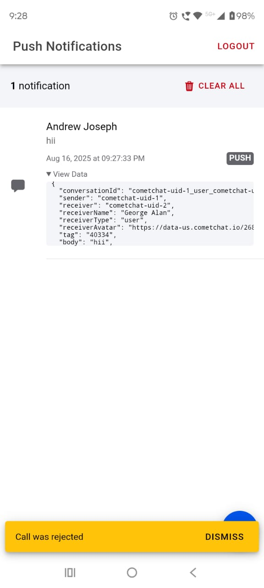
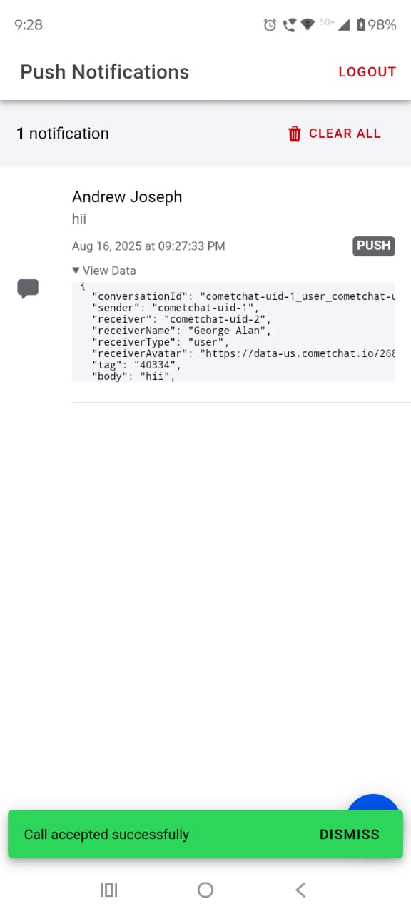

# CapacitorPushDemo App

CapacitorPush is a Capacitor plugin that provides seamless integration of Push Notifications, VoIP Pushes, and CallKit call management for iOS apps built with Capacitor. It enables native push and VoIP token management, incoming call handling, and call control without requiring users to handle native AppDelegate registration callbacks manually. The purpose of this CapacitorPushDemo App is to demonstrate how you can integrate this plugin into your own projects.

---

## Features

- Register for remote push notifications and VoIP pushes  
- Automatically handle APNS and VoIP push tokens  
- Support for CallKit incoming calls with callAccept and callReject triggers  
- Notification and CallKit event listeners in JavaScript  
---


# Getting Started with This App

This guide provides the necessary steps to set up and run this Ionic application, which uses CometChat for its messaging feature to demonstrate the features of capacitor-push plugin.

## 1. Install Dependencies

First, navigate to your project directory and install the required dependencies and sync Capacitor.

```bash
npm install
ionic cap sync
```

## 2. Configure CometChat

You will need a CometChat account and an app to use the real-time chat features.

* Go to [app.cometchat.com](https://app.cometchat.com/) and create a new app.
* Once your app is created, navigate to the **Dashboard** and copy your **App Credentials** (App ID, Region and Auth Key).
* In your app's code, update the configuration files with these credentials.
* For push notifications, go to **Notifications** in the CometChat Dashboard.
* Add your **FCM (Firebase Cloud Messaging)** and **APNs (Apple Push Notification Service)** providers and update their respective `provider IDs` and `credentials` in the placeholders of the app.

## 3. Run the Application

The final step is to build and run the app on a device or emulator using your preferred IDE.

* For **Android**: Open the project in **Android Studio**.
* For **iOS**: Open the project in **Xcode**.
* From your IDE, build and run the app on your connected device or emulator.

## Installation

1. Install the plugin package in your Capacitor project:

```bash
npm install capacitor-push@latest
npx cap sync
```

2. Open your iOS project in Xcode:

```bash
npx cap open ios
```

3. In your Xcode project, enable **Push Notifications** and **Background Modes** capabilities, especially **Voice over IP** for VoIP Pushes.

4. iOS specific setup:

For iOS push notifications and VoIP pushes to work correctly, you need to add the following methods inside your AppDelegate.swift file:

```
// Called when APNs has assigned a device token to the app
func application(_ application: UIApplication,
                 didRegisterForRemoteNotificationsWithDeviceToken deviceToken: Data) {
    // Send to default Capacitor notification (for other plugins)
    NotificationCenter.default.post(
        name: .capacitorDidRegisterForRemoteNotifications,
        object: deviceToken
    )
    
    // Send to custom CapacitorPushPlugin
    NotificationCenter.default.post(
        name: .init("CapacitorPushPluginDidRegister"),
        object: nil,
        userInfo: ["deviceToken": deviceToken]
    )
    
    // Debug log
    let tokenString = deviceToken.map { String(format: "%02x", $0) }.joined()
    print("AppDelegate: Device token received: \(tokenString)")
}

// Called when APNs registration failed
func application(_ application: UIApplication,
                 didFailToRegisterForRemoteNotificationsWithError error: Error) {
    // Send to default Capacitor notification (for other plugins)
    NotificationCenter.default.post(
        name: .capacitorDidFailToRegisterForRemoteNotifications,
        object: error
    )
    
    // Send to custom CapacitorPushPlugin
    NotificationCenter.default.post(
        name: .init("CapacitorPushPluginDidFail"),
        object: nil,
        userInfo: ["error": error]
    )
    
    // Debug log
    print("AppDelegate: Failed to register for remote notifications: \(error)")
}

```
---

## Usage

### Register for Push Notifications

```typescript
import { CapacitorPush } from 'capacitor-push';

// Register for push notifications
await CapacitorPush.register();
```

### Event Listeners

```typescript
// Listen for push token registration
CapacitorPush.addListener('registration', (data) => {
  console.log('Push token received:', data.token);
});

// Listen for VoIP token registration
CapacitorPush.addListener('voipRegistration', (data) => {
  console.log('VoIP token received:', data.token);
});

// Listen for notification received events
CapacitorPush.addListener('pushNotificationReceived', (notification) => {
    console.log('Notification:', notification);
});

// Listen for incoming call events
CapacitorPush.addListener('voipCallAccepted', (data) => {
    console.log('Incoming Call Accepted:', data);
});

// Listen for call ended events
CapacitorPush.addListener('voipCallRejected', (data) => {
  console.log('Incoming Call Rejected:', notification);
});
```

## Screenshots Android:

<p align="center">
  
  
  
  
  
  
  
  
</p>


---

## API Reference

### Methods

#### `register()`

Registers the app for remote push notifications.

**Returns:** `Promise<void>`

### Events

#### `registration`

Fired when a push token (FCM/iOS) is received.

**Data:** `{ token: string }`

#### `voipRegistration`

Fired when a VoIP token is received.

**Data:** `{ token: string }`

#### `pushNotificationReceived`

Fired when a notification is received.

**Data:** `{data: PushNotificationSchema}`
---

## Requirements

- iOS 10.0+
- Capacitor 4.0+
- Xcode 12.0+

---

## Troubleshooting

### Push notifications not working

1. Ensure you have enabled Push Notifications capability in Xcode
2. Verify your provisioning profile includes push notifications
3. Check that your APNS certificates are valid

### VoIP calls not appearing

1. Enable Background Modes > Voice over IP in Xcode capabilities
2. Ensure your app has proper CallKit permissions
3. Verify VoIP certificates are configured correctly

### Tokens not received

1. Test on a physical device (push notifications don't work in simulator)
2. Check device network connectivity
3. Verify app is properly signed with valid certificates

---

## License

MIT License